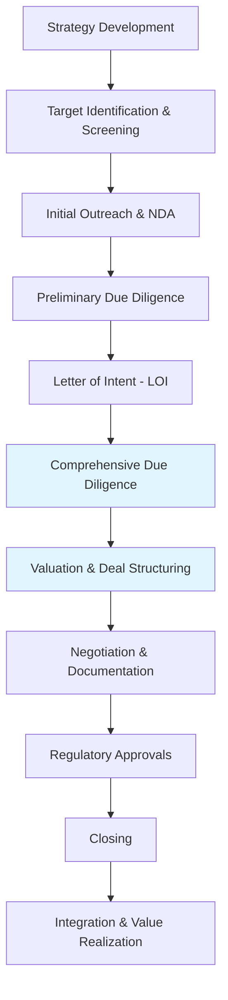

# M&A Fundamentals

## Understanding Mergers and Acquisitions

Mergers and acquisitions represent strategic transactions where companies combine, acquire, or divest business assets to achieve growth, operational efficiency, market positioning, or financial objectives. The M&A landscape encompasses diverse transaction structures, each serving distinct strategic purposes and requiring specialized due diligence approaches.

### Types of M&A Transactions

#### Mergers

A merger occurs when two companies combine to form a single entity. True mergers involve relatively equal partners creating a new combined organization, though the term is often used broadly to describe various combination structures.

**Merger of Equals**: Two companies of similar size and stature combine, typically creating a new brand identity and governance structure. These transactions emphasize partnership rather than acquisition, though one entity usually survives legally.

**Statutory Merger**: One company absorbs another, with the acquired company ceasing to exist as a separate legal entity. The surviving company assumes all assets, liabilities, contracts, and obligations.

**Consolidation**: Both combining companies dissolve, creating an entirely new legal entity. This structure is less common but used when neither party wants to be perceived as the acquirer.

!!! info "Merger vs. Acquisition Distinction"
    While "merger" suggests a partnership of equals, most transactions labeled as mergers are functionally acquisitions where one party gains control. The terminology often reflects negotiation dynamics and public relations considerations rather than legal structure.

#### Acquisitions

Acquisitions involve one company purchasing another, gaining control through ownership of assets or equity. The acquired company may continue operating as a subsidiary or be fully integrated into the acquirer's operations.

**Stock Purchase**: The buyer purchases the target company's outstanding shares, acquiring ownership of the legal entity along with all assets, liabilities, contracts, and obligations. This structure maintains business continuity but transfers historical liabilities to the buyer.

**Asset Purchase**: The buyer selects specific assets and liabilities to acquire while leaving others with the seller. This structure provides greater selectivity but requires transferring individual contracts, permits, and customer relationships.

**Tender Offer**: The buyer offers to purchase shares directly from target company shareholders, often at a premium to market price. This approach can be friendly (with board approval) or hostile (without management consent).

#### Divestitures

Divestitures involve selling, spinning off, or liquidating business units or subsidiaries. Companies pursue divestitures to focus on core operations, raise capital, satisfy regulatory requirements, or eliminate underperforming assets.

**Carve-out**: A parent company sells a partial or complete stake in a subsidiary through an initial public offering while potentially retaining some ownership.

**Spin-off**: A parent company distributes subsidiary shares to existing shareholders as a dividend, creating an independent publicly traded entity.

**Direct Sale**: The company sells a business unit or subsidiary to another company in a traditional M&A transaction.

#### Joint Ventures and Strategic Alliances

Joint ventures create new entities owned by two or more parent companies, combining resources for specific projects or markets while maintaining separate corporate identities. Strategic alliances involve collaborative agreements without creating new legal entities.

### The M&A Deal Lifecycle

M&A transactions follow a structured process from initial strategy development through post-close integration. Understanding this lifecycle helps frame due diligence timing and objectives.



!!! tip "Due Diligence Timing"
    While the diagram shows comprehensive due diligence after LOI signing, preliminary diligence occurs earlier to inform initial valuation and LOI terms. Due diligence is iterative, with findings influencing valuation, price adjustments, and deal terms throughout the process.

#### Phase 1: Strategy Development and Target Identification

Companies define acquisition criteria aligned with strategic objectives: market expansion, technology acquisition, vertical integration, horizontal consolidation, or talent acquisition. Investment bankers and corporate development teams identify potential targets matching these criteria.

#### Phase 2: Initial Outreach and Confidentiality

After identifying promising candidates, the buyer initiates contact (directly or through advisors). Parties execute non-disclosure agreements (NDAs) establishing confidentiality obligations before sharing sensitive information.

#### Phase 3: Preliminary Due Diligence

The buyer conducts high-level assessment using publicly available information, management presentations, and limited confidential data. This phase validates strategic fit and identifies major risk factors justifying deeper investigation.

#### Phase 4: Letter of Intent (LOI)

Based on preliminary findings, parties execute a non-binding letter of intent outlining key transaction terms: proposed purchase price, deal structure, timing, exclusivity period, and conditions precedent. The LOI signals serious intent while preserving flexibility for both parties.

#### Phase 5: Comprehensive Due Diligence

With LOI signed and data room access granted, the buyer conducts detailed investigation across financial, legal, operational, technological, and human capital dimensions. Due diligence teams validate assumptions, quantify risks, and identify value creation opportunities.

#### Phase 6: Valuation and Deal Structuring

Due diligence findings inform final valuation and deal structure decisions. Buyers adjust enterprise value for identified risks, normalized earnings, working capital requirements, and debt-like items. Parties negotiate earn-outs, escrows, representations, warranties, and indemnification provisions addressing identified issues.

#### Phase 7: Documentation and Negotiation

Legal teams draft definitive purchase agreements incorporating negotiated terms. Extensive negotiations address risk allocation, closing conditions, post-close covenants, and dispute resolution mechanisms.

#### Phase 8: Regulatory Approvals and Closing

Parties obtain required regulatory approvals (antitrust clearance, sector-specific regulatory consents, foreign investment reviews). Upon satisfying all closing conditions, parties execute final documentation and transfer consideration, completing the legal transaction.

#### Phase 9: Integration and Value Realization

Post-close integration converts strategic rationale into realized value. Integration teams execute day-one plans, combine operations, realize synergies, retain key talent, and monitor performance against projections.

### Strategic Rationale for M&A

Companies pursue M&A transactions to achieve objectives difficult or impossible through organic growth alone.

**Revenue Synergies**: Cross-selling opportunities, geographic expansion, product portfolio complementarity, and enhanced market positioning.

**Cost Synergies**: Economies of scale, elimination of redundancies, supply chain optimization, and shared service consolidation.

**Market Position**: Gaining market share, acquiring competitive threats, accessing new customer segments, and building strategic capabilities.

**Technology and Innovation**: Acquiring proprietary technology, accelerating innovation timelines, and accessing technical talent.

**Financial Engineering**: Tax optimization, improved capital structure, and enhanced return on invested capital.

!!! warning "Acquisition Pitfalls"
    Research consistently shows that 50-70% of acquisitions fail to create shareholder value. Common failure factors include overpayment, poor strategic fit, integration execution failures, cultural incompatibility, and loss of key talent. Rigorous due diligence helps identify these risks before closing.

### Valuation Methods Overview

Acquirers employ multiple valuation methodologies to determine fair value and establish negotiating parameters.

#### Discounted Cash Flow (DCF) Analysis

DCF valuation projects future free cash flows and discounts them to present value using the weighted average cost of capital (WACC). This intrinsic value approach reflects the company's standalone cash generation capacity.

**Strengths**: Based on fundamental cash generation; incorporates company-specific growth and risk factors; provides intrinsic value estimate.

**Limitations**: Highly sensitive to assumptions (growth rates, margins, terminal value); requires detailed projections; difficult for early-stage or turnaround situations.

#### Comparable Companies Analysis

This market-based approach compares the target to similar publicly traded companies using valuation multiples: EV/Revenue, EV/EBITDA, P/E ratio, and industry-specific metrics.

**Strengths**: Reflects current market sentiment; relatively simple to calculate; provides market reality check against DCF.

**Limitations**: Requires truly comparable companies; multiples reflect current market conditions which may be inflated or depressed; doesn't capture company-specific factors.

#### Precedent Transaction Analysis

This approach examines multiples paid in recent comparable acquisitions, reflecting control premiums and synergy expectations built into acquisition pricing.

**Strengths**: Reflects prices sophisticated buyers actually paid; incorporates control premiums; industry-relevant.

**Limitations**: Transaction details may be limited; historical deals may not reflect current market conditions; each deal has unique characteristics affecting price.

!!! example "Valuation Triangulation"
    Best practice involves triangulating across all three methodologies. If DCF suggests $500M value, comparables indicate $450-550M, and precedent transactions show $480-580M, this convergence provides confidence. Large discrepancies warrant investigation into assumptions or comparability.

### Enterprise Value vs. Equity Value

Understanding the relationship between enterprise value and equity value is fundamental to M&A valuation.

**Enterprise Value** represents the total value of the business operations, calculated as:

```
Enterprise Value = Equity Value + Net Debt + Minority Interest + Preferred Stock - Cash and Cash Equivalents
```

**Equity Value** represents the value attributable to common shareholders.

In M&A contexts, buyers typically negotiate enterprise value, then adjust for cash, debt, and working capital at closing to determine the actual cash paid to sellers.

### Key Takeaways

M&A transactions encompass diverse structures serving different strategic objectives. The deal lifecycle progresses through defined phases, with due diligence playing a critical validation role between LOI and closing. Multiple valuation methodologies provide perspective on fair value, with due diligence findings directly influencing final pricing and deal terms. Understanding these fundamentals provides essential context for the detailed due diligence workstreams explored in subsequent chapters.
