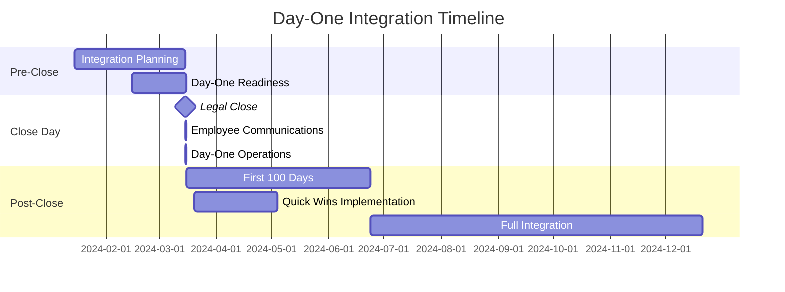

# Integration Planning and Execution

## Converting Strategic Rationale into Realized Value

Integration planning transforms acquisition rationale into operational reality. While due diligence validates the investment thesis, integration execution delivers the value. This chapter addresses integration planning frameworks, day-one readiness, the critical first 100 days, synergy identification and tracking, cultural integration, technology integration, communication strategy, and program management office structure.

### Integration Philosophy and Approach

Integration strategy should align with the transaction's strategic objectives, not follow a one-size-fits-all template.

#### Integration Models

**Full Absorption**: Target company completely integrated into buyer operations. Acquired brand eliminated or relegated to product name. Complete system and process alignment. Unified organizational structure.

**Preservation**: Target operates as autonomous subsidiary. Separate brand, culture, and operations maintained. Minimal integration beyond financial reporting. Buyer provides capital and strategic direction.

**Best-of-Both**: Selective integration of specific functions. Preserve target strengths while leveraging buyer capabilities. Hybrid approach balancing synergy capture and autonomy. Function-by-function integration decisions.

**Symbiotic**: Both companies evolve toward new combined model. Neither company's approach dominates. True merger-of-equals philosophy. Co-creation of new processes and culture.

!!! tip "Matching Approach to Rationale"
    If acquisition rationale is cost synergies through operational consolidation, full absorption makes sense. If rationale is acquiring innovation capability that could be damaged by integration, preservation is appropriate. If rationale is geographic expansion, the target's local market knowledge should be preserved while leveraging buyer's scale. Match integration approach to strategic rationale.

#### Integration Pace

Consider speed tradeoffs. Fast integration captures synergies quickly, provides clarity to employees, and allows focus to return to normal operations sooner. Measured integration preserves value in acquired company, allows time for thoughtful decisions, and reduces risk of mistakes from haste.

Pacing factors include transaction size (larger deals justify longer timelines), strategic importance (transformative deals require more attention), cultural differences (greater distance requires slower integration), business complexity (complex businesses require careful integration), and buyer experience (experienced acquirers move faster).

### Day-One Readiness

Day-one represents the legal close date when ownership transfers and the buyer assumes control. Meticulous planning ensures seamless transition without operational disruption.

#### Day-One Imperatives

Ensure business continuity: customers served without interruption, critical operations continue, employee productivity maintained, and regulatory compliance sustained.

Complete legal and compliance tasks: board of directors reconstituted per transaction terms, officer appointments effective at close, new bank signatories and authority, insurance policy transfers and new policies bound, and regulatory notifications filed.

Execute financial and administrative transitions: payroll processing continuity, accounts payable and receivable management, treasury operations and cash management, and tax withholding and reporting.

Implement communications: employee announcements and Q&A sessions, customer notifications and reassurance, vendor communications, and public announcements (press release, investor notifications).

!!! warning "Day-One Failures"
    Common day-one failures include: employees unable to access systems, customer orders not processed, payroll delays, compliance violations from missed filings. These failures damage employee morale, customer confidence, and regulatory relationships. Extensive day-one planning and testing prevent embarrassing and costly failures.

#### Day-One Checklists

**Human Resources**: Employee welcome letters and announcements, benefits information and enrollment materials, payroll cutover validated and tested, HR policies effective date and communication, and IT access (email, systems, network credentials).

**Operations**: Production schedules and work orders, vendor purchase orders and deliveries, customer shipments and service delivery, and quality assurance and safety protocols.

**Finance**: Banking relationships and account access, signing authorities updated, payment processing (AP and AR), and credit facilities and debt service.

**Legal**: Corporate governance documents executed, required regulatory filings completed, insurance certificates obtained, and contract notifications sent.

**IT**: System access for new leadership, network connectivity and remote access, email and collaboration tools, and data access and security controls.



### The First 100 Days

The first 100 days post-close establish integration momentum, build employee confidence, and deliver quick wins demonstrating acquisition value.

#### 100-Day Priorities

**Week 1-2: Foundation** - Day-one readiness execution, employee welcome and orientation, customer outreach and reassurance, and integration team mobilization.

**Week 3-4: Assessment** - Operational deep-dives validating due diligence, cultural immersion and relationship building, quick win identification, and synergy validation and refinement.

**Week 5-8: Planning** - Detailed integration workstream plans, organizational design finalization, technology integration roadmap, and communication cadence establishment.

**Week 9-12: Execution** - Quick win implementation, synergy realization initiation, process harmonization beginning, and first integration steering committee reviews.

!!! example "Quick Wins"
    Quick wins demonstrate value and build integration momentum: consolidated vendor spend achieving immediate discounts, cross-selling to existing customers, eliminating redundant subscriptions or services, sharing best practices improving efficiency. Quick wins should be genuinely valuable (not merely cosmetic) but achievable within first 90 days without major organizational disruption.

#### Integration Steering Committee

Structure the committee with executive sponsor (buyer CEO or business unit president), integration program leader (PMO director), functional workstream leads, and target company leadership representation.

Establish meeting cadence: weekly during first 100 days, bi-weekly through month 6, and monthly thereafter until integration complete.

Define agenda and decision-making: workstream progress against milestones, issue escalation and resolution, resource reallocation, and risk identification and mitigation.

### Synergy Identification and Tracking

Synergies represent the value justifying acquisition premium over standalone value. Rigorous identification, quantification, and tracking ensure projected synergies are realized.

#### Synergy Categories

**Revenue Synergies**: Cross-selling target products to buyer customers, selling buyer products to target customers, geographic expansion accelerating revenue growth, combined offerings creating new market opportunities, and enhanced competitive positioning supporting price increases.

**Cost Synergies**: Overhead consolidation (eliminate redundant corporate functions), facilities rationalization (consolidate offices, close duplicate locations), vendor consolidation (leverage combined spend for better pricing), technology rationalization (eliminate redundant systems and licenses), and manufacturing optimization (consolidate production, improve utilization).

**Financial Synergies**: Tax optimization (NOL utilization, entity structure optimization), improved borrowing terms from larger combined company, and working capital optimization.

!!! warning "Synergy Realism"
    Revenue synergies are harder to achieve and take longer than cost synergies. Cost synergies are more certain (eliminating a CFO role saves that salary) while revenue synergies depend on customer acceptance, sales execution, and market conditions. Buyers commonly overestimate revenue synergies and underestimate difficulty of cost synergy execution.

#### Synergy Quantification

Calculate cost synergies:
```
Annual Synergy = Annual Cost Eliminated - Incremental Costs
```

Example: Consolidating two data centers
- Annual cost of target data center: $2M
- One-time migration cost: $500K
- Annual incremental capacity in buyer data center: $300K
- Net annual synergy: $2M - $300K = $1.7M
- Payback period: $500K / $1.7M = 0.29 years (3.5 months)

Calculate revenue synergies:
```
Annual Revenue Synergy = New Revenue Opportunity × Penetration Rate × Margin
```

Example: Cross-selling buyer product to target customers
- Target customer base: 500 companies
- Estimated penetration rate: 20% over 2 years
- Average deal size: $50K
- Gross margin: 70%
- Year 2 annual synergy: 500 × 20% × $50K × 70% = $3.5M

#### Synergy Tracking and Accountability

Maintain a synergy register: complete list of identified synergies, quantified annual value, owner responsible for realization, implementation milestones and timeline, status (not started, in progress, completed), and actual realized value vs. projected.

Establish tracking cadence: monthly synergy realization reporting, variance analysis (projected vs. actual), risk identification for at-risk synergies, and remediation plans for delayed synergies.

Implement financial validation: finance team validation of claimed synergies, distinction between run-rate synergies achieved and synergies reflected in financials, and adjusted EBITDA calculation including realized synergies.

!!! tip "Synergy Ownership"
    Assign specific synergies to individual owners with accountability for realization. Without clear ownership, synergies remain aspirational. Include synergy realization in performance objectives and incentive compensation for integration leaders.

### Cultural Integration

Cultural integration determines whether the acquisition creates unified organization or perpetuates "us vs. them" divisions destroying collaboration and value.

#### Cultural Integration Strategies

**Assimilation**: Target company adopts buyer culture. Appropriate when buyer culture is high-performing and target culture is dysfunctional.

**Integration**: Best practices from both cultures combined. Cultural evolution for both organizations. New combined culture emerges from intentional design.

**Separation**: Distinct cultures maintained. Appropriate when target culture is value driver that could be damaged by integration.

#### Cultural Integration Activities

Conduct cultural discovery: cultural assessment during due diligence, immersion visits with employees at all levels, observation of meetings and communication patterns, and artifact review (mission/vision statements, values, office design).

Build cultural bridges: joint team projects mixing employees from both companies, cross-company mentoring and buddy programs, social events and informal networking, and office exchange programs.

Execute symbolic actions: leadership behavior modeling desired culture, recognition of employees embodying combined culture, symbols and artifacts representing combined company, and office design and naming conventions.

Harmonize policies: gradual alignment of policies and practices, transparent explanation of policy decisions, soliciting input on contentious policies, and fairness and consistency in application.

!!! info "Cultural Integration Timeline"
    Cultural integration takes longer than operational integration. While systems integrate in months, true cultural integration takes 2-3 years. Employees maintain "us vs. them" mentality long after organizational integration. Patience, consistent messaging, and symbolic actions gradually build unified culture.

### Technology Integration

Technology integration enables business integration, consolidates redundant systems, reduces costs, and creates unified platform for growth.

#### IT Integration Approaches

**Quick Cutover**: Rapid migration to buyer systems. Target systems decommissioned within months. Minimizes dual-system costs but higher risk and disruption.

**Staged Migration**: Phased approach migrating functions sequentially. Extends timeline but reduces risk. Allows learning from early migrations.

**Long-Term Coexistence**: Systems remain separate indefinitely or for extended period. Integration limited to data exchange and reporting consolidation.

#### IT Integration Priorities

Prioritize critical systems: financial systems (general ledger, AP/AR), customer-facing systems (CRM, customer portals, e-commerce), order management and fulfillment, and payroll and HR systems.

Sequence integration: (1) Immediate (Day-One): Email, network access, collaboration tools. (2) First 90 Days: Payroll, benefits administration, expense reporting. (3) Months 4-12: Financial systems, customer systems, operations systems. (4) Year 2+: Specialized systems, complete data center consolidation.

Execute data migration: data cleansing and validation before migration, master data management (customer records, product catalogs, vendors), historical data retention requirements, and data migration testing and validation.

!!! warning "System Integration Risks"
    System integration failures disrupt operations: customer orders lost during migration, duplicate customer records creating confusion, inventory data corruption causing stockouts or overstock. Extensive testing, parallel operations during transition, and rollback plans mitigate integration risks.

### Communication Strategy

Communication is the most important and most frequently underestimated integration activity. Over-communication is nearly impossible; under-communication is default.

#### Communication Principles

Practice transparency: share information early and often, acknowledge uncertainty honestly, and explain decision rationale even when decisions are difficult.

Maintain consistency: aligned messages from all leadership, consistent story across communication channels, and follow-through on commitments.

Enable two-way dialogue: create forums for questions and concerns, listen to employee feedback and respond, and acknowledge and address rumors.

#### Communication Audiences

Address employees (most important stakeholder, highest need for frequent communication), customers (need reassurance of continuity and commitment), vendors (need continuity of purchase orders and payments), investors if applicable (acquisition rationale and integration progress), and regulators (required notifications and filings).

### Program Management Office (PMO) Structure

The integration PMO provides coordination, governance, tracking, and support for all integration workstreams.

#### PMO Leadership

Appoint integration program leader: senior executive dedicated full-time to integration, direct access to CEO and executive leadership, authority to resolve cross-functional issues, and accountability for integration success.

Build PMO team: workstream leads for each functional area, project managers supporting workstream leads, business analysts tracking metrics and dependencies, and communications lead managing all integration communication.

#### PMO Responsibilities

Execute planning and coordination: integration master plan development, workstream plan integration and dependency management, resource allocation and conflict resolution, and integration calendar and milestone tracking.

Provide tracking and reporting: integration dashboard with key metrics, milestone completion tracking, synergy realization reporting, and risk and issue management.

Establish governance: steering committee support, decision-making facilitation, escalation management, and change control.

Manage knowledge: integration playbook development, lessons learned capture, best practice documentation, and knowledge transfer for future acquisitions.

#### Integration Workstreams

Common workstreams include Finance (financial system integration, close process, reporting), HR (organization design, compensation, HR systems, cultural integration), IT (technology integration, cybersecurity, data migration), Operations (facility consolidation, process harmonization, supply chain), Sales and Marketing (customer communication, go-to-market strategy, brand), Legal (contract integration, compliance, policy alignment), and Facilities (real estate consolidation, lease negotiations, office integration).

!!! tip "PMO Success Factors"
    Successful integration PMOs have: (1) executive sponsorship and empowerment to make decisions, (2) dedicated resources not splitting time with day jobs, (3) clear governance with rapid escalation and decision-making, (4) transparency in tracking and reporting, and (5) flexibility to adapt plans based on learning and changing circumstances.

### Integration Metrics and Success Measures

Define success metrics before integration begins and track progress consistently.

Track integration progress metrics: milestone completion percentage on time, synergy realization (actual vs. projected by quarter), and budget adherence (integration costs vs. budget).

Monitor business performance metrics: revenue growth vs. standalone projections, EBITDA margin including realized synergies, customer retention (customer attrition rates), and employee retention (voluntary attrition, particularly key employees).

Watch leading indicators: employee engagement (pulse survey results), customer satisfaction (NPS or CSAT scores), and integration team health (PMO team retention, workstream progress).

### Key Takeaways

Integration planning converts acquisition rationale into operational reality. Day-one readiness ensures seamless transition, the first 100 days establish momentum with quick wins, and disciplined synergy tracking ensures value realization. Cultural integration determines whether the acquisition creates unified organization or perpetuates division. Technology integration enables business integration while consolidating redundant systems. Over-communication prevents uncertainty while building employee confidence. A well-structured PMO provides coordination, tracking, and governance ensuring integration stays on track. Success requires matching integration approach to strategic rationale, moving quickly where possible while taking time for thoughtful decisions, maintaining business continuity throughout, and measuring progress against defined success metrics.
